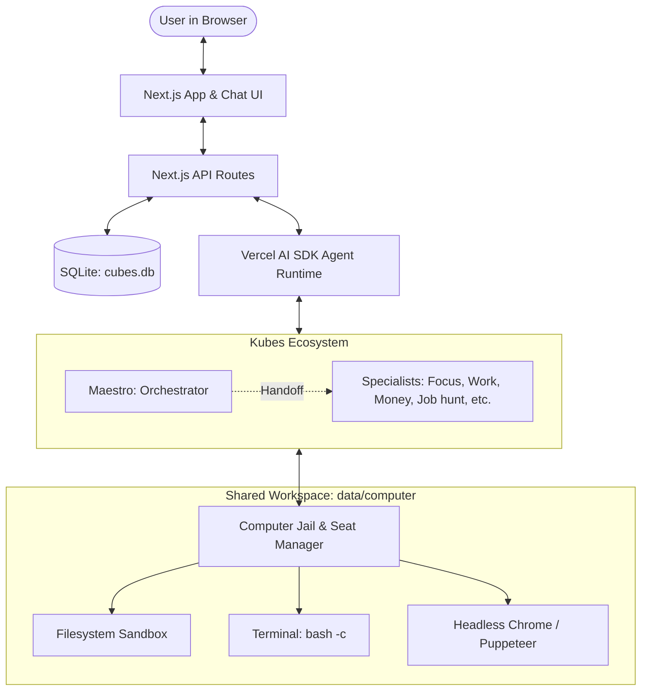

# Kubes

> **Local-first multi-agent workspace with specialist routing, a shared computer, and cron schedules.**

[](LICENSE)
[](https://nextjs.org/)
[](https://sdk.vercel.ai/)
[](https://sqlite.org/)

**Kubes** is a local, privacy-centric AI assistant environment. It operates entirely on your machine without external user tracking, accounts, or telemetry. 

You chat with **Maestro**, the default coordinator, who delegates complex problems to purpose-tuned specialist Kubes (Focus, Work, Money, Job hunt, Body, Write, Learn, Life admin, Calm). Each specialist operates with its own system prompt, pain point specialization, and model configuration, while sharing access to a controlled workspace computer for executing shell commands, reading/writing files, and interacting with web pages.

---

## Key Features

- **Maestro & Specialist Roster:** Maestro analyzes your goal and hands it off to the best specialist in a clean, one-hop delegation pattern. You can also chat directly with any specialist at any time.
- **Shared Workspace Computer (`data/computer`):**
  - **Directory Isolation:** Each Cube has its own isolated filesystem sandbox (`data/computer/cubes/<slug>`). Maestro can read across all directories to oversee work, but writes remain strictly scoped to each Cube.
  - **Single-Seat Execution Mutex:** Terminal commands and headless browser sessions share a single seat lock with automated concurrency management.
  - **Headless Browser Navigation:** Built-in Puppeteer integration allows agents to open web pages, click elements, fill forms, and render live screenshots directly to the UI.
- **Live Tune & Roster Management:** Modify instructions, pain points, names, or swap LLM models on the fly through the UI. Edits take effect immediately on the next message turn.
- **In-App Cron Schedules:** Define recurring automated instructions using cron presets (hourly, daily, weekly) or custom 5-field cron expressions. Runs execute against the machine clock and write output to dedicated chat threads.
- **Provider Agnostic:** Compatible with any OpenAI-compatible `/chat/completions` API endpoint, including xAI (Grok), OpenAI, OpenRouter, Groq, Ollama, and vLLM.

---

## Architecture Overview



---

## The Kubes Roster

| Cube | Role & Specialization |
| :--- | :--- |
| **Maestro** | Orchestrates tasks, coordinates specialists, and tunes/creates new Kubes. |
| **Focus** | Eliminates procrastination, breaks down overwhelming projects into atomic steps. |
| **Work** | Helps with workplace dynamics, project structuring, and current job challenges. |
| **Job hunt** | Manages job applications, interview prep, resumes, and maintains trackers. |
| **Money** | Budget planning, expense categorization, and financial discipline (non-advisory). |
| **Body** | Daily movement, sleep routines, posture, and wellness habits. |
| **Learn** | Deep conceptual breakdowns, Feynman technique, and guided skill mastery. |
| **Write** | Drafting, refining, editing essays, reports, and clear communications. |
| **Life admin** | Untangling bureaucratic chores, gathering documents, and drafting emails. |
| **Calm** | Grounding techniques, stress reduction, and reflective listening. |

---

## Computer Tools

Agents have access to a controlled tool suite executed within the workspace:

| Tool | Capability | Access Scope |
| :--- | :--- | :--- |
| `computer_list` | Lists files and directory trees. | Maestro sees all; specialists see own directory. |
| `computer_read` | Reads text file content up to 32KB. | Maestro can read any; specialists read own. |
| `computer_write` | Creates and writes text files. | Strictly scoped to the Cube's own folder. |
| `computer_exec` | Executes a single bash command in a clean env. | Scoped working directory, 30s timeout, seat lock. |
| `computer_browse` | Loads a public http(s) URL and extracts text. | Public URLs only, captures screen to UI. |
| `computer_click` | Clicks elements by text or CSS selector. | Operates on active browser page. |
| `computer_type` | Types text into input fields. | Operates on active browser page. |

---

## Quickstart

### 1. Prerequisites
- **Node.js** v20+ or v22+
- **Google Chrome / Chromium** (required only when an agent browses web pages; default path `/usr/bin/google-chrome`)

### 2. Installation

```bash
git clone https://github.com/pisigmac/Kubes.git
cd Kubes
npm install
```

### 3. Environment Configuration

Copy the example configuration file:

```bash
cp .env.example .env.local
```

Configure your API key and base URL in `.env.local`:

```env
# Default: xAI Grok
OPENAI_BASE_URL="https://api.x.ai/v1"
OPENAI_API_KEY="your-xai-api-key"
OPENAI_MODEL="grok-4.7"

# Alternative: OpenAI
# OPENAI_BASE_URL="https://api.openai.com/v1"
# OPENAI_API_KEY="sk-..."
# OPENAI_MODEL="gpt-4o"

# Alternative: OpenRouter
# OPENAI_BASE_URL="https://openrouter.ai/api/v1"
# OPENAI_API_KEY="sk-or-..."
# OPENAI_MODEL="anthropic/claude-3.7-sonnet"
```

### 4. Run Development Server

```bash
npm run dev
```

Open [http://localhost:3000](http://localhost:3000) in your browser.

---

## Configuration Variables

| Variable | Description | Default |
| :--- | :--- | :--- |
| `OPENAI_BASE_URL` | Base URL for OpenAI-compatible `/chat/completions` endpoint. | `https://api.x.ai/v1` |
| `OPENAI_API_KEY` | API key sent in Authorization header (`XAI_API_KEY` also supported). | — |
| `OPENAI_MODEL` | Default fallback model name. | `grok-4.7` |
| `CUBES_CHROME` | Absolute path to Chrome / Chromium binary. | `/usr/bin/google-chrome` |
| `CUBES_COMPUTER_ROOT` | Root directory for workspace computer files. | `data/computer` |
| `CUBES_SEAT_WAIT_MS` | Max wait time (ms) to acquire terminal/browser seat. | `20000` |

---

## Testing & Quality Assurance

Run the automated test suite covering jail security, directory isolation, cron calculations, seat locking, and URL validation:

```bash
# Run unit & integration tests
npm test

# Run TypeScript typechecks
npx tsc --noEmit

# Run ESLint
npm run lint
```

For a comprehensive technical audit and quality report, see [DOCUMENTATION.md](DOCUMENTATION.md) and [QUALITY_REVIEW.md](QUALITY_REVIEW.md).

---

## Project Structure

```
.
├── app/
│   ├── api/             # REST endpoints (chat, cubes, computer, schedules, threads, models)
│   ├── layout.tsx       # Root layout & theme configuration
│   └── page.tsx         # Main entry point & SSR data loader
├── components/          # React client UI components (chat, transcript, editors, computer pane)
├── lib/
│   ├── ai/              # Provider resolution and model discovery
│   ├── computer/        # Jail boundaries, browser automation, schedules, and tools
│   ├── cubes/           # Catalog definitions, agent runtime, store, and busy tracking
│   └── db.ts            # SQLite schema initialization and migrations
├── public/              # Static icons and assets
└── data/                # (Ignored) SQLite databases and workspace files
```

---

## License

Distributed under the [MIT License](LICENSE). Copyright (c) 2026 pisigmac.
